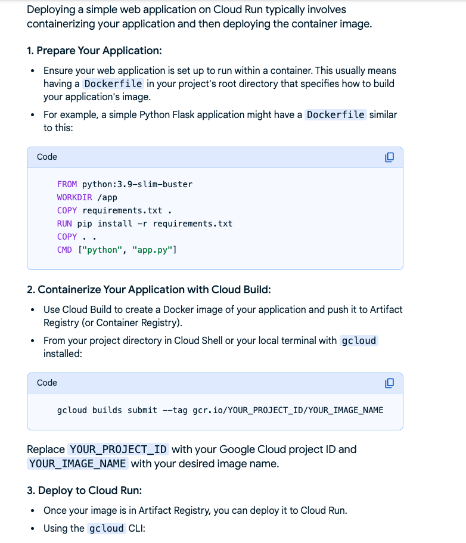
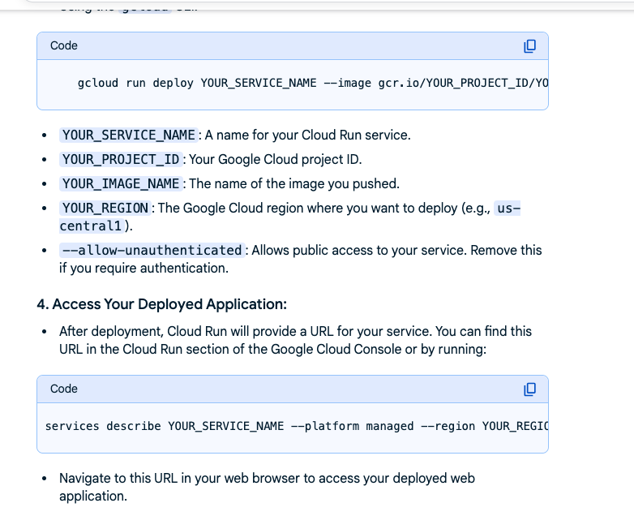

Deploying a simple web application on Cloud Run typically involves containerizing your application and then deploying the container image.
1. Prepare Your Application:
Ensure your web application is set up to run within a container. This usually means having a Dockerfile in your project's root directory that specifies how to build your application's image.
For example, a simple Python Flask application might have a Dockerfile similar to this:

    FROM python:3.9-slim-buster
    WORKDIR /app
    COPY requirements.txt .
    RUN pip install -r requirements.txt
    COPY . .
    CMD ["python", "app.py"]

    2. Containerize Your Application with Cloud Build:
Use Cloud Build to create a Docker image of your application and push it to Artifact Registry (or Container Registry).
From your project directory in Cloud Shell or your local terminal with gcloud installed:

  ##  gcloud builds submit --tag gcr.io/YOUR_PROJECT_ID/YOUR_IMAGE_NAME

  ## ex: gcloud builds submit --tag gcr.io/<project_id>/hello_world
Replace YOUR_PROJECT_ID with your Google Cloud project ID and YOUR_IMAGE_NAME with your desired image name.
3. Deploy to Cloud Run:
Once your image is in Artifact Registry, you can deploy it to Cloud Run.
Using the gcloud CLI:

    ## gcloud run deploy YOUR_SERVICE_NAME --image gcr.io/YOUR_PROJECT_ID/YOUR_IMAGE_NAME --platform managed --region YOUR_REGION --allow-unauthenticated

YOUR_SERVICE_NAME: A name for your Cloud Run service.
YOUR_PROJECT_ID: Your Google Cloud project ID.
YOUR_IMAGE_NAME: The name of the image you pushed.
YOUR_REGION: The Google Cloud region where you want to deploy (e.g., us-central1).
--allow-unauthenticated: Allows public access to your service. Remove this if you require authentication.
4. Access Your Deployed Application:
After deployment, Cloud Run will provide a URL for your service. You can find this URL in the Cloud Run section of the Google Cloud Console or by running:

    gcloud run services describe YOUR_SERVICE_NAME --platform managed --region YOUR_REGION --format "value(status.url)"

    gcloud run services describe hello-world --platform managed --region us-west1 --format "value(status.url)"
https://hello-world-h2hrdbqsxq-uw.a.run.app

### screen shots ####

